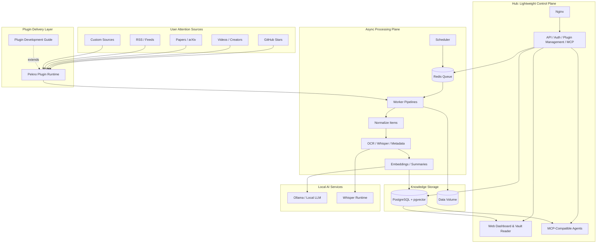

<p align="center">
  
</p>

<h1 align="center">Pekno</h1>

<p align="center">
  <strong>A Self-Hosted, AI-Native Knowledge Operating System.</strong>
</p>

<p align="center">
  <a href="./LICENSE"></a>
  
  
</p>

## What Is Pekno?

Pekno is a self-hosted knowledge operating system that turns the scattered content you already care about into standardized, agent-ready knowledge.
Think of it as a private kitchen: your followed repositories, videos, papers, feeds, bookmarks, and creator updates are the ingredients; plugins are the delivery workers that bring those ingredients in; pipelines are the chefs that clean, normalize, enrich, and prepare them for your agents or for you to read on the web.
It is not just a feed subscription tool: it connects local LLMs through Ollama, multimedia transcription through Whisper, durable knowledge storage through PostgreSQL `pgvector`, and tool-facing automation through MCP.

## Core Features


- **Command-center dashboard**: observe sync state, scheduler health, worker activity, plugin status, and system logs from one place.


- **Vault-style reader**: browse saved knowledge with an Obsidian-inspired reading flow designed for long-term retention and retrieval.
- **Plugin-driven ingestion**: bring content from GitHub, Bilibili, arXiv, RSS, video platforms, paper sources, and any custom source you can model as a plugin.
- **Pipeline-first processing**: normalize incoming items, extract readable text, enrich metadata, run OCR/transcription, generate embeddings, and prepare output for humans or agents.
- **Local-first AI pipeline**: use Ollama, Whisper, OCR, and PostgreSQL `pgvector` without sending private content to third-party services by default.
- **Agent-ready output**: expose clean, structured knowledge through the web UI and MCP instead of forcing agents to scrape fragmented sources again.

## Plugin System & Pipelines

Pekno treats every source as a plugin and every incoming item as raw material for a standardized processing pipeline. A plugin knows how to fetch source-specific data, while Pekno provides the shared runtime for scheduling, credentials, storage, manual sync, auto-sync, and UI integration.

The pipeline turns heterogeneous source data into consistent knowledge objects:

- **Fetch**: plugins collect content from platforms, feeds, APIs, or custom sources.
- **Normalize**: each item becomes a stable Pekno record with source type, title, link, content, tags, metadata, and intent.
- **Enrich**: workers run text extraction, OCR, transcription, summarization, embeddings, and source-specific hover blocks.
- **Serve**: processed knowledge is available in the dashboard, the vault-style reader, and MCP-compatible agent workflows.

To build a plugin, start with the [Pekno Plugin Development Guide](./Pekno_Plugin.md). If you use a CLI coding agent, clone this repository first and ask the agent to read `Pekno_Plugin.md` before writing code; that file documents the runtime contract, manifest format, credential rules, framework-injected settings, and worker-side pipeline expectations.

## Quick Start

Clone the repository, create your environment file, and start Pekno with Docker Compose:

```bash
git clone https://github.com/your-org/pekno.git && cd pekno && cp .env.example .env && docker compose up -d --build
```

Open the app at:

```text
http://localhost:9080
```

The included `docker-compose.yaml` starts the full runtime stack:

```yaml
services:
  nginx:
    ports:
      - "9080:80"
    depends_on:
      hub:
        condition: service_started

  hub:
    command: ["uv", "run", "python", "hub/main.py"]
    depends_on:
      postgres:
        condition: service_healthy
      redis:
        condition: service_started

  worker:
    command: ["uv", "run", "taskiq", "worker", "worker.main:broker"]
    depends_on:
      postgres:
        condition: service_healthy
      redis:
        condition: service_started

  scheduler:
    command: ["sh", "-lc", "uv run python scripts/scheduler_bootstrap.py && uv run taskiq scheduler worker.main:scheduler"]

  postgres:
    image: ankane/pgvector:latest

  redis:
    image: redis:7-alpine
```

For worker-side ML acceleration, configure the worker extension in `worker.ml.yml`. Hub stays CPU-only by design.

## Architecture & Plugins



Pekno keeps lightweight control-plane work in Hub and moves expensive knowledge processing to workers. Plugin authors should start with the [Pekno Plugin Development Guide](./Pekno_Plugin.md).
