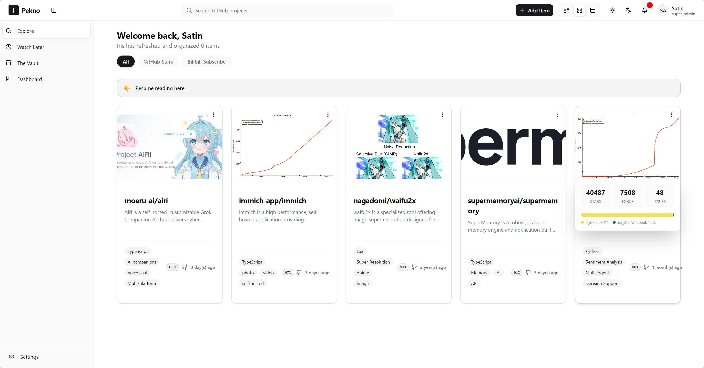
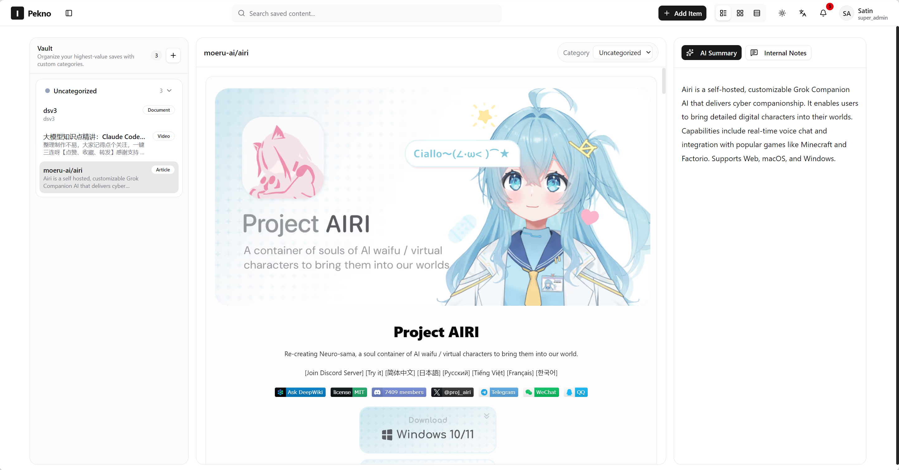
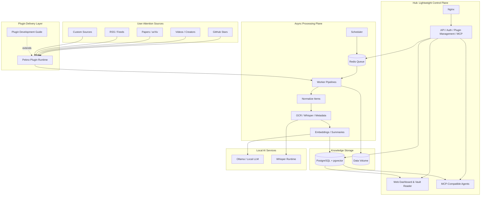

<p align="center">
  
</p>

<h1 align="center">Pekno</h1>

<p align="center">
  <strong>A Self-Hosted, AI-Native Knowledge Operating System.</strong>
</p>

<p align="center">
  <a href="./LICENSE"></a>
  
  
  
  
  
  
  
  <a href="https://github.com/Sat1n/Pekno/actions/workflows/docker-publish.yml"></a>
</p>

## What Is Pekno?

Pekno is a self-hosted knowledge operating system that turns the scattered content you already care about into standardized, agent-ready knowledge.
Think of it as a private kitchen: your followed repositories, videos, papers, feeds, bookmarks, and creator updates are the ingredients; plugins are the delivery workers that bring those ingredients in; pipelines are the chefs that clean, normalize, enrich, and prepare them for your agents or for you to read on the web.
It is not just a feed subscription tool: it connects local LLMs through Ollama, multimedia transcription through Whisper, durable knowledge storage through PostgreSQL `pgvector`, and tool-facing automation through MCP.

## Core Features



- **Command-center dashboard**: observe sync state, scheduler health, worker activity, plugin status, and system logs from one place.



- **Vault-style reader**: browse saved knowledge with an Obsidian-inspired reading flow designed for long-term retention and retrieval.
- **Plugin-driven ingestion**: bring content from GitHub, Bilibili, arXiv, RSS, video platforms, paper sources, and any custom source you can model as a plugin.
- **Pipeline-first processing**: normalize incoming items, extract readable text, enrich metadata, run OCR/transcription, generate embeddings, and prepare output for humans or agents.
- **Local-first AI pipeline**: use Ollama, Whisper, OCR, and PostgreSQL `pgvector` without sending private content to third-party services by default.
- **Agent-ready output**: expose clean, structured knowledge through the web UI and MCP instead of forcing agents to scrape fragmented sources again.

## Plugin System & Pipelines

Pekno treats every source as a plugin and every incoming item as raw material for a standardized processing pipeline. A plugin knows how to fetch source-specific data, while Pekno provides the shared runtime for scheduling, credentials, storage, manual sync, auto-sync, and UI integration.

The pipeline turns heterogeneous source data into consistent knowledge objects:

- **Fetch**: plugins collect content from platforms, feeds, APIs, or custom sources.
- **Normalize**: each item becomes a stable Pekno record with source type, title, link, content, tags, metadata, and intent.
- **Enrich**: workers run text extraction, OCR, transcription, summarization, embeddings, and source-specific hover blocks.
- **Serve**: processed knowledge is available in the dashboard, the vault-style reader, and MCP-compatible agent workflows.

To build a plugin, start with the [Pekno Plugin Development Guide](./PEKNO_PLUGIN_GUIDE.md). If you use a CLI coding agent, clone this repository first and ask the agent to read `PEKNO_PLUGIN_GUIDE.md` before writing code; that file documents the runtime contract, manifest format, credential rules, framework-injected settings, and worker-side pipeline expectations.

### Installing Plugins

Pekno includes a built-in GitHub Stars plugin, so GitHub repository collection works out of the box after you configure credentials.

For third-party plugins, download the plugin repository as a ZIP archive from GitHub instead of cloning it locally. Open the plugin repository, choose **Code** -> **Download ZIP**, then go to Pekno's plugin page, click install, select the downloaded ZIP file, and finish the installation.

The first official plugin is [PeknoPlugin_bilibili_subscribe](https://github.com/Sat1n/PeknoPlugin_bilibili_subscribe), which syncs Bilibili subscription content into Pekno.

## Quick Start

Use the prebuilt GHCR images if you only want to run Pekno:

```bash
PEKNO_REPO=Sat1n/Pekno
wget -O docker-compose.prod.yml "https://raw.githubusercontent.com/${PEKNO_REPO}/main/docker-compose.prod.yml"
wget -O .env.example "https://raw.githubusercontent.com/${PEKNO_REPO}/main/.env.example"
cp .env.example .env
docker compose -f docker-compose.prod.yml up -d
```

Edit `.env` before starting if you need to change the HTTP port, database password, image owner, image tag, timezone, or `OLLAMA_BASE_URL`.

### CUDA Worker Deployment

To use the prebuilt CUDA worker image on a NAS or Linux host, use `docker-compose.prod.cuda.yml` instead of the default CPU compose file. Make sure the host has an NVIDIA GPU, a working NVIDIA driver, and NVIDIA Container Toolkit installed. A quick host check should succeed before you start the CUDA stack:

```bash
nvidia-smi
docker run --rm --gpus all nvidia/cuda:12.2.2-cudnn8-runtime-ubuntu22.04 nvidia-smi
```

Download the CUDA production compose file:

```bash
wget -O docker-compose.prod.cuda.yml "https://raw.githubusercontent.com/${PEKNO_REPO}/main/docker-compose.prod.cuda.yml"
```

Then start the CUDA stack directly:

```bash
docker compose -f docker-compose.prod.cuda.yml up -d
```

Use either `docker-compose.prod.yml` for CPU or `docker-compose.prod.cuda.yml` for CUDA. Avoid running both stacks at the same time unless you intentionally want both workers consuming jobs from the same Redis queue. ROCm and other accelerators do not have official production compose files yet.

Clone the repository, create your environment file, and start Pekno with Docker Compose:

```bash
git clone https://github.com/Sat1n/Pekno.git && cd Pekno && cp .env.example .env && docker compose up -d --build
```

Open the app at:

```text
http://localhost:9080
```

The included `docker-compose.yaml` starts the full runtime stack:

```yaml
services:
  nginx:
    ports:
      - "9080:80"
    depends_on:
      hub:
        condition: service_started

  hub:
    command: ["uv", "run", "python", "hub/main.py"]
    depends_on:
      postgres:
        condition: service_healthy
      redis:
        condition: service_started

  worker:
    command: ["uv", "run", "taskiq", "worker", "worker.main:broker"]
    depends_on:
      postgres:
        condition: service_healthy
      redis:
        condition: service_started

  scheduler:
    command: ["sh", "-lc", "uv run python scripts/scheduler_bootstrap.py && uv run taskiq scheduler worker.main:scheduler"]

  postgres:
    image: ankane/pgvector:latest

  redis:
    image: redis:7-alpine
```

For worker-side ML acceleration in local builds, configure the worker extension in `worker.ml.yml`. For prebuilt images, use `docker-compose.prod.yml` for CPU or `docker-compose.prod.cuda.yml` for CUDA. Hub stays CPU-only by design.

### ML Runtime Roadmap

Hardware acceleration support is tracked explicitly:

- [x] **CPU**: default worker runtime, available through `docker-compose.prod.yml`.
- [x] **NVIDIA CUDA 12**: prebuilt `pekno-worker-cuda12` image, available through `docker-compose.prod.cuda.yml`.
- [ ] **AMD ROCm**: planned; no official production compose file yet.
- [ ] **Apple Silicon / Metal**: planned investigation for local developer workflows.
- [ ] **Intel GPU / oneAPI**: planned investigation.
- [ ] **Other community runtimes**: welcome as focused proposals once the worker runtime contract stabilizes.

## Architecture & Plugins



Pekno keeps lightweight control-plane work in Hub and moves expensive knowledge processing to workers. Plugin authors should start with the [Pekno Plugin Development Guide](./PEKNO_PLUGIN_GUIDE.md).
